<p align="center"></p>
This package is for the purpose of updating the Flutter version. We still respect the original package

[convex_bottom_bar](https://pub.dev/packages/convex_bottom_bar)

---

The official BottomAppBar can only display a notch FAB with an app bar, and sometimes we need a convex FAB. BottomAppBar and NotchShape's implementation inspires this ConvexAppBar.

Here are some supported style:

|             **fixed**             |            **react**             |      **badge chip**       |
| :-------------------------------: | :------------------------------: | :-----------------------: |
|     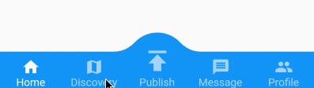     |         | 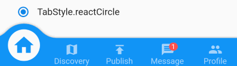 |
|          **fixedCircle**          |         **reactCircle**          |         **flip**          |
| 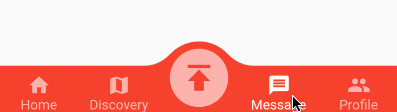  | 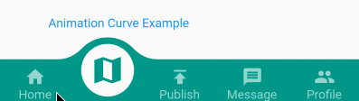 | 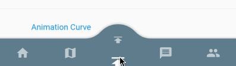  |
|            **textIn**             |            **titled**            |       **tab image**       |
|    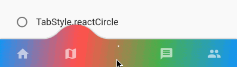     |    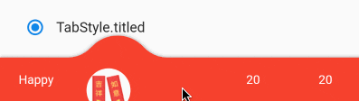    | 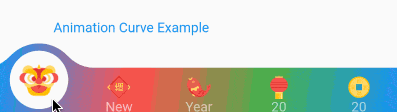 |
|            **button**             |         **fixed corner**         |                           |
| 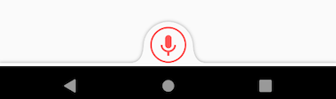 | 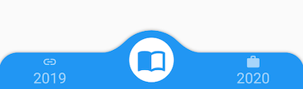 |                           |

## How to use

Typically ConvexAppBar can work with `Scaffold` by setup its `bottomNavigationBar`.

The `ConvexAppBar` has two constructors. The `ConvexAppBar()` will use the default style to simplify the tab creation.

Add this to your package's pubspec.yaml file, use the latest version:

```yaml
dependencies:
  convex_bottom_bar_renew: ^latest_version
```

```dart
import 'package:convex_bottom_bar_renew/convex_bottom_bar_renew.dart';

Scaffold(
  bottomNavigationBar: ConvexAppBar(
    items: [
      TabItem(icon: Icons.home, title: 'Home'),
      TabItem(icon: Icons.map, title: 'Discovery'),
      TabItem(icon: Icons.add, title: 'Add'),
      TabItem(icon: Icons.message, title: 'Message'),
      TabItem(icon: Icons.people, title: 'Profile'),
    ],
    onTap: (int i) => print('click index=$i'),
  )
);
```

**Flutter Version Support**  
As Flutter is developing fast. There can be breaking changes. We will be trying to support the
stable version and beta version through different package versions.

| **Stable Flutter Version** | **Package Version** |                                  **More**                                  |
| :------------------------: | :-----------------: | :------------------------------------------------------------------------: |
|          >=3.7.0           |       >=3.2.0       |   Since v3.7.0, the stable version changed the DefaultTabController api    |
|           >=1.20           |       >=2.4.0       |           Since v1.20, the stable version changed the Stack api            |
|           <1.20            |       <=2.3.0       | Support for stable version such as v1.17, v1.12 is not going to be updated |

## Features

- Provide multiple internal styles
- Ability to change the theme of AppBar
- Provide builder API to customize a new style
- Add badge on the tab menu
- Elegant transition animation
- Provide hook API to override some of the internal styles
- RTL support

## Table of contents

- [Theming](#theming)
- [Badge](#badge)
- [Single Button](#single-button)
- [Style Hook](#style-hook)
- [RTL Support](#rtl-support)
- [Custom Example](#custom-example)
- [FAQ](#faq)
- [Donate](#donate)

## Theming

The bar will use default style, you may want to theme it. Here are some supported attributes:

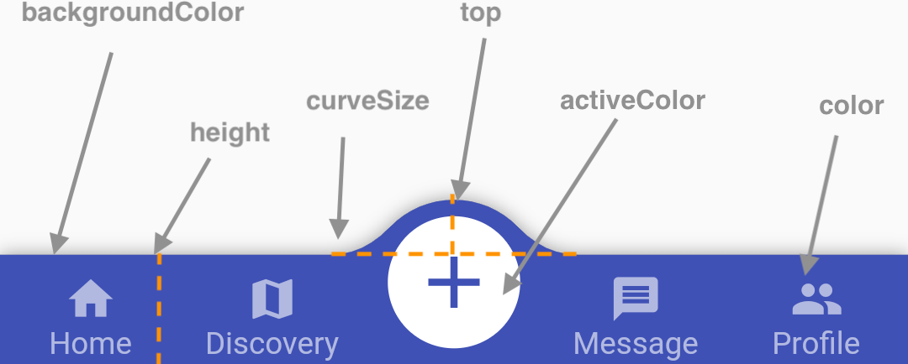

| Attributes      | Description                                                                          |
| --------------- | ------------------------------------------------------------------------------------ |
| backgroundColor | AppBar background                                                                    |
| gradient        | gradient will override backgroundColor                                               |
| height          | AppBar height                                                                        |
| color           | tab icon/text color                                                                  |
| activeColor     | tab icon/text color **when selected**                                                |
| curveSize       | size of the convex shape                                                             |
| top             | top edge of the convex shape relative to AppBar                                      |
| cornerRadius    | draw the background with topLeft and topRight corner; Only work with fixed tab style |
| style           | style to describe the convex shape: **fixed, fixedCircle, react, reactCircle**, ...  |
| chipBuilder     | custom badge builder, use **ConvexAppBar.badge** for default badge                   |

## Badge

If you need to add a badge on the tab, use the `ConvexAppBar.badge` to get it done.

[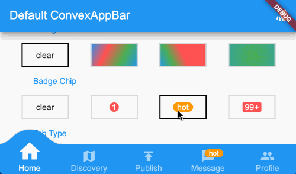](doc/badge-demo.mp4 "badge demo")

```dart
ConvexAppBar.badge({0: '99+', 1: Icons.assistant_photo, 2: Colors.redAccent},
  items: [
    TabItem(icon: Icons.home, title: 'Home'),
    TabItem(icon: Icons.map, title: 'Discovery'),
    TabItem(icon: Icons.add, title: 'Add'),
  ],
  onTap: (int i) => print('click index=$i'),
);
```

The `badge()` method accepts an array of badges; The `badges` is a map with tab items. Each value of entry can be either `String`, `IconData`, `Color` or `Widget`.

## Single Button

If you only need a single button, checkout the `ConvexButton`.

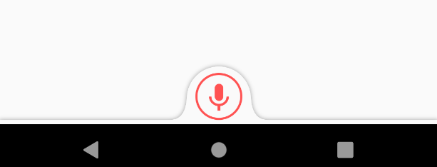

```dart
Scaffold(
  appBar: AppBar(title: const Text('ConvexButton Example')),
  body: Center(child: Text('count $count')),
  bottomNavigationBar: ConvexButton.fab(
    onTap: () => setState(() => count++),
  ),
);
```

## Style Hook

Hook for internal tab style. Unlike the `ConvexAppBar.builder`, you may want to update the tab style without defining a new tab style.

**Warning:**  
This hook is limited and can lead to `overflow broken` if the size you provide does not match with internal style.

```dart
StyleProvider(
  style: Style(),
  child: ConvexAppBar(
    initialActiveIndex: 1,
    height: 50,
    top: -30,
    curveSize: 100,
    style: TabStyle.fixedCircle,
    items: [
      TabItem(icon: Icons.link),
      TabItem(icon: Icons.import_contacts),
      TabItem(title: "2020", icon: Icons.work),
    ],
    backgroundColor: _tabBackgroundColor,
  ),
)
class Style extends StyleHook {
  @override
  double get activeIconSize => 40;

  @override
  double get activeIconMargin => 10;

  @override
  double get iconSize => 20;

  @override
  TextStyle textStyle(Color color) {
    return TextStyle(fontSize: 20, color: color);
  }
}
```

## RTL Support

RTL is supported internally, and if you define the TextDirection inside the app, the AppBar should work fine.
Both RTL and LTR can be configured through `Directionality`:

```dart
Directionality(
  textDirection: TextDirection.rtl,
  child: Scaffold(body:ConvexAppBar(/*TODO ...*/)),
)
```

## Custom Example

If the default style does not match your situation, try with `ConvexAppBar.builder()`, allowing you to custom nearly all the tab features.

```dart
Scaffold(
  bottomNavigationBar: ConvexAppBar.builder(
    count: 5,
    backgroundColor: Colors.blue,
    itemBuilder: Builder(),
  )
);

// user defined class
class Builder extends DelegateBuilder {
  @override
  Widget build(BuildContext context, int index, bool active) {
    return Text('TAB $index');
  }
}
```
